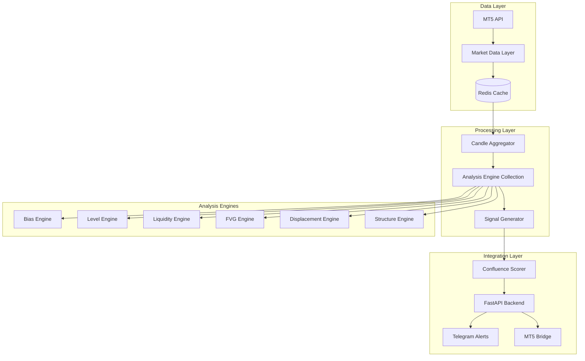

# Python Strategy Engine - Technical Design Document

## Overview

The Python Strategy Engine transforms Aegis Trader from a webhook-dependent system into a self-contained real-time market analysis platform. This engine replaces TradingView signal generation with native Python-based technical analysis, maintaining the existing 100-point confluence scoring system while eliminating external dependencies.

The system follows a clean, modular architecture designed to stay under 500 lines of core logic by leveraging composition over inheritance, event-driven processing, and efficient data structures. The engine processes US30 market data through a pipeline of specialized analysis components, each focused on a single responsibility.

### Key Design Principles

- **Single Responsibility**: Each component handles one specific aspect of market analysis
- **Event-Driven Architecture**: Components communicate through events to maintain loose coupling
- **Memory Efficiency**: Redis-based caching with intelligent data retention policies
- **Performance First**: Sub-5-second signal generation through optimized data structures
- **Graceful Degradation**: System continues operating even when individual components fail

## Architecture

The system employs a layered architecture with clear separation between data ingestion, analysis, and signal generation:



### Core Components

**Market Data Layer**: Manages real-time data ingestion from MT5, handles connection failures, and maintains data quality validation.

**Candle Aggregator**: Builds higher timeframe candles from 1-minute base data using efficient rolling window algorithms.

**Analysis Engine Collection**: Orchestrates six specialized engines that detect specific market patterns and confluence factors.

**Signal Generator**: Combines analysis results through the existing confluence scoring system to produce actionable trading signals.

## Components and Interfaces

### Market Data Layer

```python
class MarketDataLayer:
    """Manages real-time US30 data ingestion and validation"""
    
    async def fetch_latest_candle(self) -> Candle
    async def validate_data_integrity(self, candle: Candle) -> bool
    async def store_candle(self, candle: Candle) -> None
    async def get_historical_candles(self, count: int) -> List[Candle]
```

**Responsibilities:**
- Fetch 1-minute OHLCV data every 60 seconds
- Validate timestamp accuracy and data completeness
- Implement retry logic with exponential backoff
- Maintain 2000-candle rolling window in Redis

**Integration Points:**
- MT5 API for live data
- Redis for data persistence
- Event system for new data notifications

### Candle Aggregator

```python
class CandleAggregator:
    """Builds higher timeframe candles from 1-minute base data"""
    
    async def process_new_candle(self, candle: Candle) -> None
    async def get_timeframe_candles(self, tf: Timeframe, count: int) -> List[Candle]
    def _aggregate_candle(self, tf: Timeframe, base_candles: List[Candle]) -> Candle
```

**Responsibilities:**
- Aggregate 1M data into 5M, 15M, 1H, 4H, Daily, Weekly timeframes
- Maintain 500-candle history per timeframe
- Trigger analysis events on candle completion
- Handle session boundary alignment

**Key Algorithms:**
- Rolling window aggregation for memory efficiency
- Session-aware daily candle boundaries (00:00 UTC)
- Incremental updates to avoid full recalculation

### Analysis Engine Collection

```python
class AnalysisEngineCollection:
    """Orchestrates specialized analysis engines"""
    
    def __init__(self):
        self.engines = {
            'bias': BiasEngine(),
            'levels': LevelEngine(),
            'liquidity': LiquidityEngine(),
            'fvg': FVGEngine(),
            'displacement': DisplacementEngine(),
            'structure': StructureEngine()
        }
    
    async def analyze_timeframe(self, tf: Timeframe) -> AnalysisResult
    async def get_confluence_factors(self) -> Dict[str, Any]
```

Each specialized engine implements the `AnalysisEngine` interface:

```python
class AnalysisEngine(ABC):
    @abstractmethod
    async def analyze(self, candles: List[Candle]) -> EngineResult
    
    @abstractmethod
    def get_confluence_contribution(self) -> Dict[str, float]
```

### Signal Generator

```python
class SignalGenerator:
    """Generates trading signals from confluence analysis"""
    
    async def evaluate_setup(self, analysis: AnalysisResult) -> Optional[Signal]
    def _calculate_levels(self, setup_type: SetupType, entry: float) -> TradeLevels
    def _validate_session_timing(self) -> bool
```

**Signal Generation Logic:**
1. Collect confluence factors from all engines
2. Apply existing 100-point scoring system
3. Determine setup type and trade direction
4. Calculate entry, stop loss, and take profit levels
5. Validate session timing and risk parameters

## Data Models

### Core Data Structures

```python
@dataclass
class Candle:
    timestamp: datetime
    open: float
    high: float
    low: float
    close: float
    volume: int
    timeframe: Timeframe

@dataclass
class AnalysisResult:
    timestamp: datetime
    timeframe: Timeframe
    bias: BiasResult
    levels: LevelResult
    liquidity: LiquidityResult
    fvg: FVGResult
    displacement: DisplacementResult
    structure: StructureResult
    confluence_score: float

@dataclass
class Signal:
    timestamp: datetime
    setup_type: SetupType
    direction: Direction
    entry: float
    stop_loss: float
    take_profit: float
    confluence_score: float
    grade: SignalGrade
    analysis_breakdown: Dict[str, Any]
```

### Engine-Specific Results

```python
@dataclass
class BiasResult:
    direction: BiasDirection  # bullish, bearish, neutral, bull_shift, bear_shift
    ema_distance: float
    structure_shift: Optional[StructureShift]

@dataclass
class LevelResult:
    nearest_250: float
    nearest_125: float
    distance_to_250: float
    distance_to_125: float

@dataclass
class LiquidityResult:
    recent_sweeps: List[LiquiditySweep]
    sweep_type: Optional[SweepType]  # buy_side, sell_side
    time_since_sweep: Optional[timedelta]

@dataclass
class FVGResult:
    active_fvgs: List[FairValueGap]
    retest_opportunity: Optional[FVGRetest]
    
@dataclass
class DisplacementResult:
    recent_displacement: Optional[DisplacementCandle]
    direction: Optional[Direction]
    strength: float

@dataclass
class StructureResult:
    recent_breaks: List[StructureBreak]
    current_trend: TrendDirection
    break_type: Optional[BreakType]  # BOS, CHoCH
```

### Redis Data Schema

**Key Patterns:**
- `candles:1M`: Sorted set of 1-minute candles (2000 max)
- `candles:{timeframe}`: Sorted set per timeframe (500 max)
- `analysis:{timeframe}`: Latest analysis result per timeframe
- `signals:recent`: List of recent signals (24h retention)
- `levels:current`: Current key levels (250pt, 125pt)
- `fvg:active`: Active fair value gaps
- `liquidity:sweeps`: Recent liquidity sweeps

**Memory Optimization:**
- Use Redis sorted sets for time-series data
- Implement TTL for automatic cleanup
- Compress historical data using MessagePack
- Maintain separate hot/cold data tiers

## Correctness Properties

*A property is a characteristic or behavior that should hold true across all valid executions of a system-essentially, a formal statement about what the system should do. Properties serve as the bridge between human-readable specifications and machine-verifiable correctness guarantees.*

After analyzing the acceptance criteria, several properties can be consolidated to eliminate redundancy while maintaining comprehensive coverage. The following properties represent the core correctness guarantees of the Python Strategy Engine:

### Property 1: Market Data Integrity

*For any* fetched market data, the validation process should ensure OHLCV completeness, timestamp accuracy, and proper sequencing before storage.

**Validates: Requirements 1.2**

### Property 2: Rolling Window Storage Limits

*For any* data storage component (candles, analysis results, signals), adding items beyond the configured limit should maintain exactly the specified count by removing the oldest entries.

**Validates: Requirements 1.3, 2.2, 3.6, 4.4**

### Property 3: Retry Logic with Exponential Backoff

*For any* failed operation with retry configuration, the system should attempt exactly the specified number of retries with exponentially increasing delays between attempts.

**Validates: Requirements 1.4**

### Property 4: Candle Aggregation Mathematical Correctness

*For any* set of 1-minute candles being aggregated to a higher timeframe, the resulting candle should follow OHLC rules: Open equals first candle's open, High equals maximum high, Low equals minimum low, Close equals last candle's close.

**Validates: Requirements 2.5**

### Property 5: Session Boundary Alignment

*For any* daily candle aggregation, the candle boundaries should align with 00:00 UTC regardless of when the individual 1-minute candles were received.

**Validates: Requirements 2.3**

### Property 6: EMA Calculation Accuracy

*For any* sequence of price data and specified period, the calculated EMA should match the mathematical formula: EMA = (Price × Multiplier) + (Previous EMA × (1 - Multiplier)) where Multiplier = 2/(Period + 1).

**Validates: Requirements 3.1**

### Property 7: Bias Classification Logic

*For any* price and EMA pair, the bias classification should be: bullish when price > EMA + 10 points, bearish when price < EMA - 10 points, neutral when price is within ±10 points of EMA.

**Validates: Requirements 3.2, 3.3, 3.4**

### Property 8: Key Level Rounding Accuracy

*For any* price value, the calculated key levels should round to the nearest 250-point and 125-point increments using standard mathematical rounding rules.

**Validates: Requirements 4.1, 4.2**

### Property 9: Distance Calculation Correctness

*For any* current price and key level, the distance calculation should return the absolute difference between the price and the nearest level.

**Validates: Requirements 4.5**

### Property 10: Liquidity Sweep Detection

*For any* price wick that extends beyond a previous swing high/low by at least 10 points, the system should detect and classify it as a buy-side (above resistance) or sell-side (below support) liquidity sweep.

**Validates: Requirements 5.1, 5.4**

### Property 11: FVG Detection and Classification

*For any* three consecutive candles where the gap between candle 1's high/low and candle 3's low/high exceeds 20 points with no overlapping wicks, the system should detect an FVG and classify it as bullish (gap up) or bearish (gap down).

**Validates: Requirements 6.1, 6.2**

### Property 12: FVG Fill Status Tracking

*For any* detected FVG, when price action overlaps with the gap range, the fill status should update to "partially filled" or "filled" based on the extent of overlap.

**Validates: Requirements 6.3**

### Property 13: Displacement Candle Validation

*For any* single candle with movement exceeding 50 points, it should be classified as displacement only if the candle body represents more than 80% of the total range (minimal wicks).

**Validates: Requirements 7.1, 7.3**

### Property 14: Structure Break Classification

*For any* price movement that breaks previous swing highs/lows, the system should classify it as BOS (break of structure) when in trend direction or CHoCH (change of character) when counter-trend, with appropriate directional classification.

**Validates: Requirements 8.1, 8.2, 8.3**

### Property 15: Signal Grade Classification

*For any* confluence score, the signal grade should be classified as: A+ for scores ≥85, A for scores 75-84, B for scores <75.

**Validates: Requirements 9.3**

### Property 16: Session-Based Signal Filtering

*For any* time outside the active trading sessions (London: 10:00-13:00 SAST, NY: 15:30-17:30 SAST, Power Hour: 20:00-22:00 SAST), signal generation should be suppressed unless override mode is enabled.

**Validates: Requirements 9.5, 10.2**

### Property 17: Processing Time Performance

*For any* new market data arrival, the complete processing pipeline (data validation → candle aggregation → analysis → signal generation) should complete within 5 seconds.

**Validates: Requirements 12.1**

### Property 18: Error Recovery and Degraded Mode

*For any* critical system error, the system should send immediate alerts and continue operating in degraded mode rather than complete failure.

**Validates: Requirements 12.5**

### Property 19: Data Persistence Round Trip

*For any* market data persisted to PostgreSQL, retrieving and reloading the data should produce equivalent candle structures with matching OHLCV values and timestamps.

**Validates: Requirements 13.1, 13.2**

### Property 20: Configuration Parameter Application

*For any* environment variable configuration change, the system should apply the new parameters to analysis engines without requiring a restart.

**Validates: Requirements 14.1, 14.5**

## Error Handling

The system implements a multi-layered error handling strategy designed to maintain continuous operation even when individual components fail:

### Connection Failure Recovery

**MT5 Connection Failures:**
- Automatic reconnection with exponential backoff (1s, 2s, 4s, 8s, max 30s)
- Graceful degradation to cached data during outages
- Health check monitoring with automatic failover

**Redis Connection Failures:**
- Fallback to in-memory storage for critical data
- Automatic reconnection attempts every 30 seconds
- Data synchronization upon reconnection

### Data Quality Assurance

**Invalid Data Handling:**
- Timestamp validation against expected intervals
- OHLC relationship validation (High ≥ Open,Close; Low ≤ Open,Close)
- Volume validation for non-negative values
- Automatic data correction for minor inconsistencies

**Missing Data Recovery:**
- Gap detection in time series data
- Interpolation for small gaps (<5 minutes)
- Historical data backfill for larger gaps
- Alert generation for significant data loss

### Analysis Engine Failures

**Individual Engine Isolation:**
- Each analysis engine operates independently
- Engine failures don't cascade to other components
- Partial confluence scoring when engines are unavailable
- Automatic engine restart attempts

**Signal Generation Fallback:**
- Minimum confluence threshold enforcement
- Degraded mode operation with reduced signal frequency
- Manual override capabilities for critical situations

### System Resource Management

**Memory Pressure Handling:**
- Automatic cache cleanup when memory usage exceeds 400MB
- Prioritized data retention (recent data over historical)
- Emergency data compression for critical situations

**CPU Overload Protection:**
- Analysis throttling during high load periods
- Priority queuing for real-time vs historical analysis
- Automatic load balancing across available cores

## Testing Strategy

The Python Strategy Engine employs a comprehensive dual testing approach combining unit tests for specific scenarios with property-based tests for universal correctness guarantees.

### Unit Testing Approach

**Component-Level Testing:**
- Mock MT5 API responses for data layer testing
- Redis integration tests with test containers
- Analysis engine tests with known market scenarios
- Signal generation tests with predefined confluence setups

**Integration Testing:**
- End-to-end pipeline tests with simulated market data
- Session management tests across timezone changes
- Error recovery tests with simulated failures
- Performance tests with high-frequency data streams

**Edge Case Coverage:**
- Market gap scenarios (weekend opens, news events)
- Extreme price movements and volatility spikes
- System restart during active market hours
- Partial data availability scenarios

### Property-Based Testing Configuration

**Testing Framework:** Hypothesis (Python)
**Minimum Iterations:** 100 per property test
**Data Generators:** Custom generators for OHLCV data, price movements, and market scenarios

**Property Test Implementation:**
Each correctness property will be implemented as a single property-based test with the following tag format:

```python
@given(market_data_strategy())
def test_property_1_market_data_integrity(data):
    """Feature: python-strategy-engine, Property 1: Market Data Integrity"""
    # Test implementation
```

**Test Data Generation:**
- Realistic OHLCV data with proper relationships
- Various timeframe scenarios and market conditions
- Edge cases like gaps, spikes, and low volume periods
- Session boundary conditions and timezone transitions

**Coverage Requirements:**
- 100% line coverage for core analysis engines
- 95% branch coverage for error handling paths
- Performance benchmarks for all critical paths
- Memory usage validation under load conditions

### Continuous Integration

**Automated Testing Pipeline:**
- Unit tests run on every commit
- Property tests run on pull requests
- Integration tests run on staging deployments
- Performance regression tests run nightly

**Quality Gates:**
- All tests must pass before deployment
- Code coverage thresholds must be maintained
- Performance benchmarks must not regress
- Memory usage must stay within VPS limits

The testing strategy ensures that the Python Strategy Engine maintains the same reliability and accuracy as the existing TradingView-based system while providing the flexibility and control needed for advanced trading strategies.